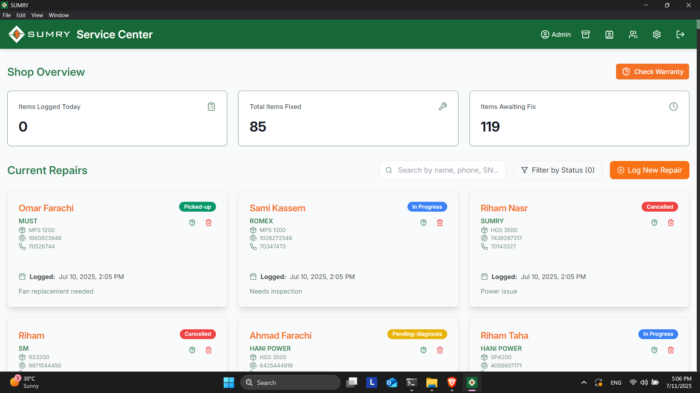
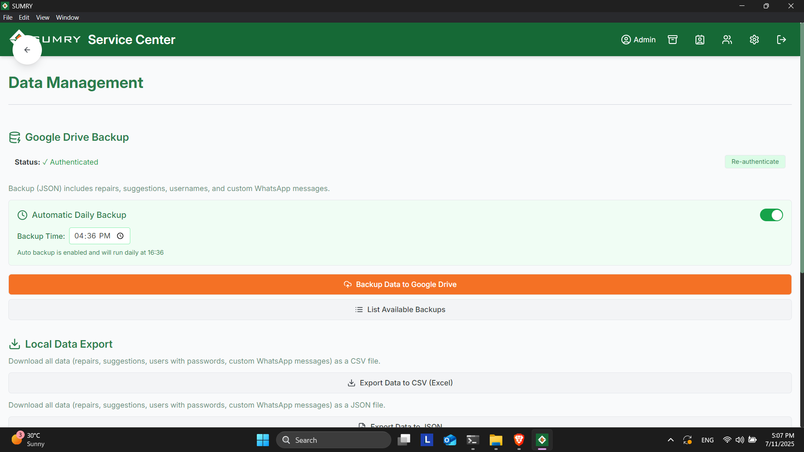
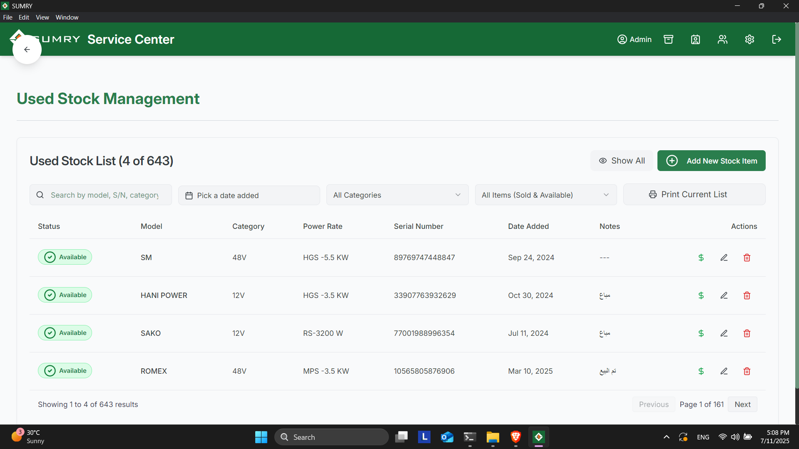
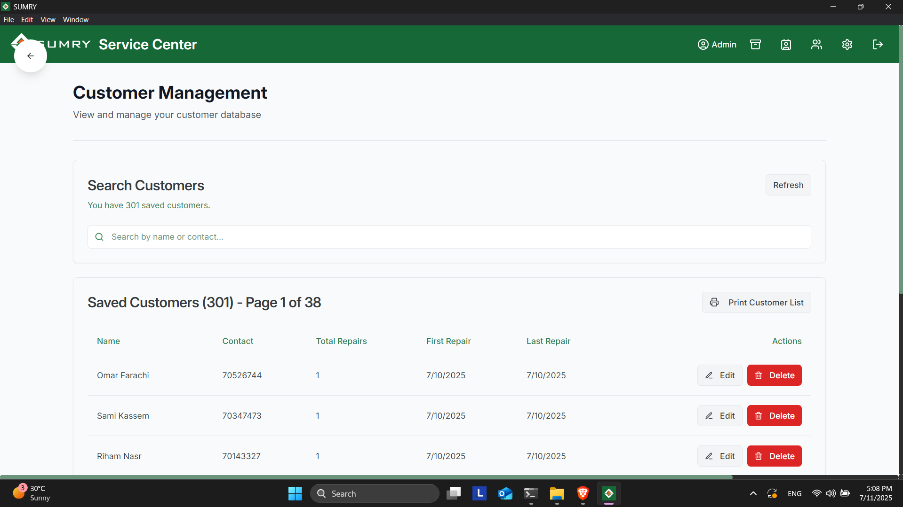
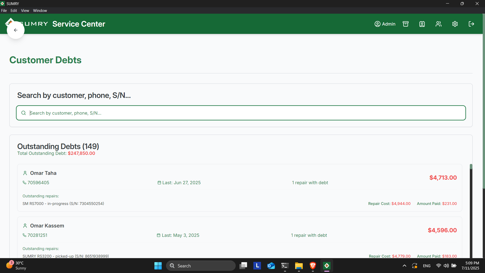

# 🔧 Solar Repairs Desktop App

A powerful, cross-platform Electron desktop application built for the **Repair Department** of a solar systems company. Designed to streamline repair tracking, customer management, stock usage, and data backups — all in one easy-to-use interface.

## 🛠️ Tech Stack

- ⚡ Electron.js – Desktop wrapper
- ⚛️ React.js – Frontend UI
- 💬 TypeScript – Type safety
- 🗃️ SQLite3 – Local lightweight database
- 🎨 TailwindCSS – Utility-first styling

---

## 📦 Key Features

### 🏪 Shop Overview Dashboard
Get a quick glance at repair shop performance:
- **Items Logged Today**
- **Total Items Fixed**
- **Items Awaiting Fix**

---

### 🔧 Repair Management
Manage all ongoing repairs with ease:
- **Current Repairs View**: List of all active repair jobs.
- **Add New Repair**: Quickly register new repair cases.
- **Repair Details Page**: Each repair card is fully clickable and opens its own page.
- **Edit Repairs**: Modify repair details like status, notes, and assigned technician.
- **WhatsApp Integration**: One-click messaging to notify customers and share repair updates or history.
- **Inventory Suggestions**: Auto-suggest inputs based on historical data.

---

### ✅ Warranty Checker
- Validate item warranties instantly using serial numbers

---

### 🗂️ Used Stock Management
Control used spare parts and materials:
- **Add / Delete Stock Items**
- **Mark as Sold or Available**

---

### 👤 Customer Management
Manage your customer base efficiently:
- **Customer Info**: Contact details, repair history, and preferences.
- **Debt Tracking**: Record and manage customer debts and payments.

---

### 💬 WhatsApp Message Templates
- Reusable and customizable message templates for customer communication.

---

### ☁️ Data Management & Backup
Robust data control tools:
- **Google Drive Authentication**: Backup your database securely to the cloud.
- **Auto-Backup Toggle**: Enable/disable auto-backups with scheduled time.
- **Export Data**: Export in CSV or JSON formats.
- **Import Data**: Restore from JSON or Google Drive backups.

---

## 📸 Screenshots

### 🪟 Intro Page

### 🏠 Home Page

### ☁️ Data Management

### 🗂️ Used Stock Management

### 👤 Customer Management

### 💵 Customer Debts

---

